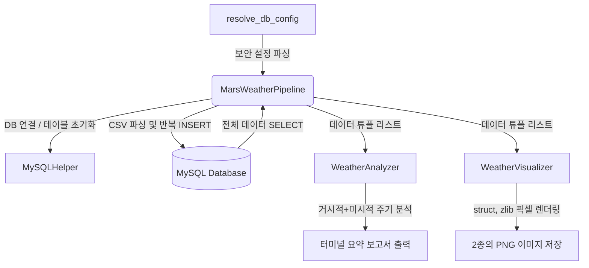

# Step 12 - 화성 날씨 데이터 MySQL 적재 및 정밀 분석 (문제 5)

이동 경로를 정한 뒤, 화성 모래 폭풍 주기(트렌드)를 분석하여 한송희 박사의 이동 예정일이 안전한지 판단하기 위해 미션 컴퓨터에 백업된 날씨 CSV를 MySQL에 저장·분석하는 과제입니다.

## 📂 파일 구성

| 파일 | 설명 |
|------|------|
| `mars_weather_summary.py` | CSV 마이그레이션, 날씨 주기 분석, 시각화(PNG) 엔진을 포함한 메인 스크립트 |
| `mars_weathers_data.csv` | 화성 날씨 원본 데이터 (1000행) |
| `db_config.local.py` | [보안] 로컬 DB 접속 정보 (Git 업로드 제외) |
| `mars_temp_summary.png` | [출력물] 온도 변화 추이 선 그래프 (실행 시 생성) |
| `mars_storm_summary.png` | [출력물] 모래 폭풍 강도 막대그래프 (실행 시 생성) |

## ⚙️ 사전 준비

1. **MySQL** 설치 및 서버 실행
2. Python 패키지 설치 (`mysql-connector-python` 외 외부 라이브러리 사용 금지)

```bash
pip install mysql-connector-python
```

3. **보안 설정 파일 작성**
루트 경로에 `db_config.local.py` 파일을 생성하고 아래와 같이 접속 정보를 입력합니다.
```python
# db_config.local.py
DB_CONFIG = {
    'host': '127.0.0.1',
    'user': 'root',
    'database': 'mars_db'
}
MYSQL_PASSWORD = '본인비밀번호'
```
> **Tip:** 비밀번호를 누락하거나 파일을 만들지 않아도, 실행 시 터미널에서 `getpass` 모듈을 통해 **안전하게 비밀번호를 입력(마스킹)** 받을 수 있도록 하위 호환(Fallback) 로직이 구현되어 있습니다.

## 📊 CSV 데이터 형식

```csv
weather_id,mars_date,temp,stom
1,2050-01-01,21.4,56
2,2050-01-02,24.67,53
...
```

- **오타 보정:** `stom` 헤더를 코드가 자동으로 감지하여 `storm` 데이터로 매핑합니다.
- **타입 변환:** 소수점으로 된 온도 데이터(`21.4` 등)는 DB 스키마에 맞게 정수로 반올림 변환되어 들어갑니다.

## 🗄️ 테이블 스키마 (`mars_weather`)

```sql
CREATE TABLE IF NOT EXISTS mars_weather (
    weather_id INT AUTO_INCREMENT PRIMARY KEY,
    mars_date DATETIME NOT NULL,
    temp INT NOT NULL,
    storm INT NOT NULL
);
```

## ▶️ 실행 방법

```bash
cd step12
python mars_weather_summary.py
```

## 🔄 코드 흐름 및 아키텍처

본 프로젝트는 단일 책임 원칙(SRP)에 따라 철저히 객체지향적으로 분리되어 있습니다.



### 1단계: 보안 파싱 및 DB 연결 (`resolve_db_config` & `MySQLHelper`)
- Configuration as Code 패턴을 사용해 로컬 파일과 환경 변수를 병합합니다.
- Context Manager(`with` 구문)를 지원하여 에러 시에도 안전하게 연결을 종료합니다.

### 2단계: 데이터 마이그레이션 파이프라인 (`MarsWeatherPipeline`)
- CSV 파일을 `utf-8-sig`로 안전하게 열어 내용을 콘솔에 확인 출력합니다.
- 모든 데이터를 플레이스홀더(`%s`) 대신 **온전한 `INSERT` 쿼리 문자열**로 직접 조립하여 반복 실행합니다.

### 3단계: 화성 날씨 정밀 분석 (`WeatherAnalyzer`)
- 단순 전날 데이터 예측이 아닌 **[주기 분석 알고리즘]**을 도입했습니다.
- 최근 10일(현재 주기)과 이전 10일(과거 주기)의 폭풍 평균을 비교하여, 폭풍이 잦아드는 **"안전/휴지기"**인지 판단하고 논리적인 이동 가능 여부 메시지를 도출합니다.

### 4단계: 커스텀 시각화 엔진 (`WeatherVisualizer`)
- `matplotlib` 일체 없이 파이썬 표준 라이브러리만으로 픽셀을 계산해 PNG를 생성합니다.
- **데이터 스무딩(Binning):** 1000일 치 데이터를 10일 단위 평균으로 압축하여 가독성 높은 트렌드를 보여줍니다.
- **동적 스케일링:** 0~100도, 0~100강도에 맞춰 동적 Y축 눈금을 생성하며 2개의 독립된 그래프 파일로 분리 저장합니다.

## ✅ 과제 요구사항 체크리스트

| 항목 | 구현 |
|------|------|
| `mars_weather` 테이블 (PK, AUTO_INCREMENT, NOT NULL) | `_setup_database()` |
| Python → MySQL 연결 및 환경 변수 처리 | `resolve_db_config()`, `MySQLHelper` |
| CSV 읽기·내용 확인 출력 | `migrate_weather_data()` 내 반복문 `print` |
| INSERT 쿼리 변환·문자열 반복 실행 | `migrate_weather_data()` |
| 이동 예정일 및 모래 폭풍 분석 출력 | `WeatherAnalyzer` |
| 결과 PNG 저장 (외부 라이브러리 금지) | `WeatherVisualizer` (`struct`, `zlib`) |
| PEP 8, 함수 snake_case, 클래스 CapWord | ✓ 적용 완료 |

## 🚨 검증 시 발견·수정한 이슈 (Troubleshooting)

1. **CSV 데이터 품질 이슈 (헤더 & 소수점):** 
   - **이슈:** `storm`이 `stom`으로 기재되어 있고, 온도가 실수형.
   - **해결:** `header.index('stom')` 폴백 로직 추가 및 `int(round())` 처리로 DB 스키마 충돌 방어.
## 🔍 MySQL Workbench 수동 확인 쿼리

```sql
USE mars_db;
SELECT COUNT(*) FROM mars_weather;          -- 1000이 나오면 정상 적재
SELECT * FROM mars_weather WHERE storm > 70
SELECT mars_date, temp, storm FROM mars_weather ORDER BY mars_date DESC LIMIT 10;
```